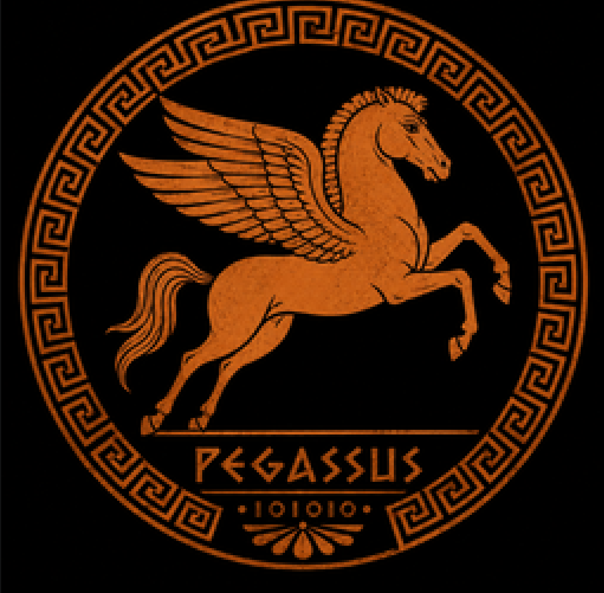

# Pegassus / Pegassus

## English

<div align="center">
  
  <br/>
  <strong>Stack VM · IR · Optimizer · Optional native</strong>
  <br/>
  Version 1.9.12
</div>

## What is this?
Pegassus is a stack machine and IR written in Altair. Compile `src/pegassus.at` with `altairc`.

## Quick start
```text
altairc src/pegassus.at -o pegassus
pegassus run examples/loop_sum.ir
pegassus testsuite
```

## Memory (1.9.12)
- Stack: **1 MiB** → 131072 entries  
- Locals: **1 MiB** → 131072 slots  

## Docs
Start at [docs/00-INDEX.md](docs/00-INDEX.md). Library ABI: [docs/libs/01-abi.md](docs/libs/01-abi.md).

## Layout
```text
src/pegassus.at      VM + assembler + optimizer
engine/pegbin.c      native subset
lib/pegstd.ir        pure stdlib
examples/            samples
docs/                full bilingual documentation
assets/pegassus-logo.png
```

---

## Español

<div align="center">
  
  <br/>
  <strong>VM de pila · IR · Optimizador · Nativo opcional</strong>
  <br/>
  Versión 1.9.12
</div>

## ¿Qué es?
Pegassus es una máquina de pila e IR en Altair. Compila `src/pegassus.at` con `altairc`.

## Inicio rápido
```text
altairc src/pegassus.at -o pegassus
pegassus run examples/loop_sum.ir
pegassus testsuite
```

## Memoria (1.9.12)
- Pila: **1 MiB** → 131072 entradas  
- Locales: **1 MiB** → 131072 slots  

## Docs
[docs/00-INDEX.md](docs/00-INDEX.md). ABI de libs: [docs/libs/01-abi.md](docs/libs/01-abi.md).

## Estructura
```text
src/pegassus.at      VM + ensamblador + optimizador
engine/pegbin.c      subconjunto nativo
lib/pegstd.ir        stdlib pura
examples/            ejemplos
docs/                documentación bilingüe completa
assets/pegassus-logo.png
```
